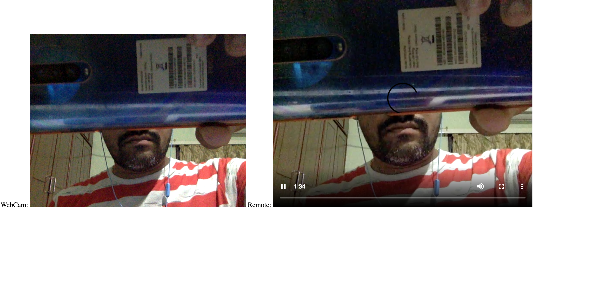
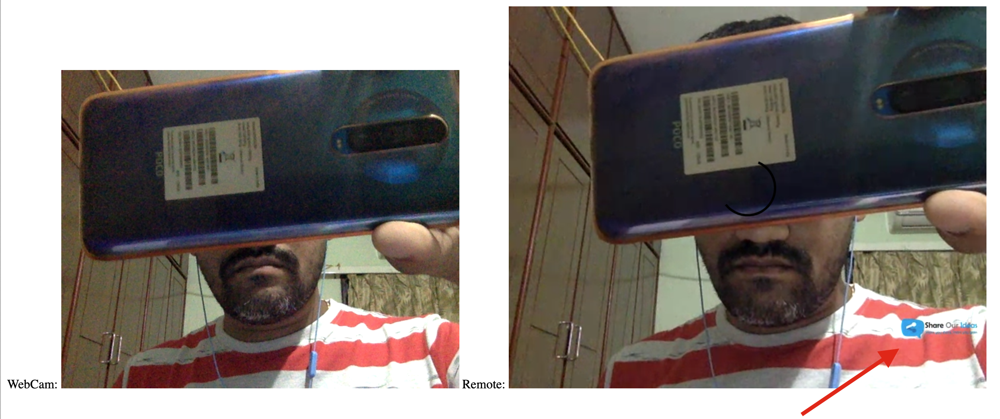

Live Video Streaming
---
___
This is demo app for **live video streaming**. Only for basic idea how we can stream live video using **WebSocket**. 

Install steps
---
___
* Download the code as zip or clone it.
* run ```npm install``` on root directory
* run ```npm start``` to start the application (or use VS Code debug to launch with debug)

Preview image
---
___
Preview of WebSocket data as it is

Preview of WebSocket data and modify using ffmpeg



To use ffmpeg
---
___
Comment below lines of code in **server.js**
```javascript
/*
for (var client in clients){
    clients[client].write(data); // Sending ws data back
}
*/
```

Uncomment the code below line of code in **server.js**
```javascript
ffmpeg.stdin.write(data);
```

**Note:- This is just a demo application, did not handle socket connections. And also there is a deply of stream video. If we use ffmpeg to modify video it will take bit more time. WebRTC or RTMP media servers will give low latency.** 
